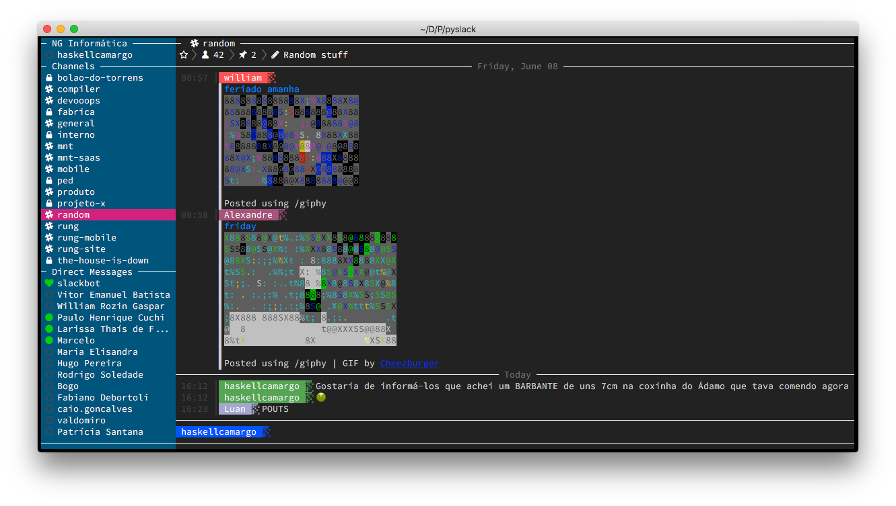
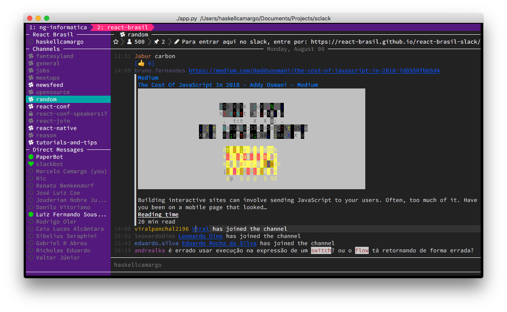
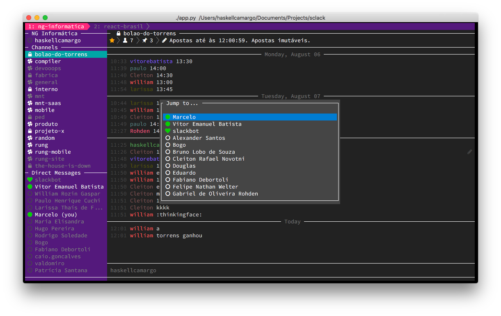
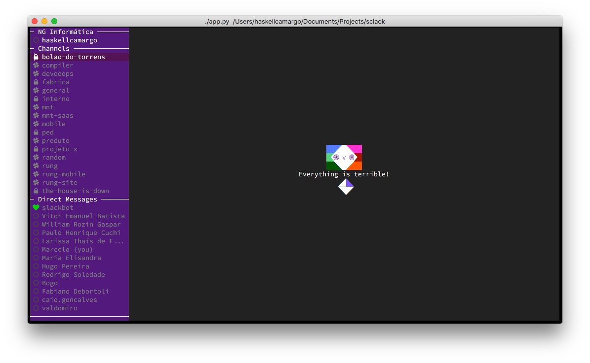
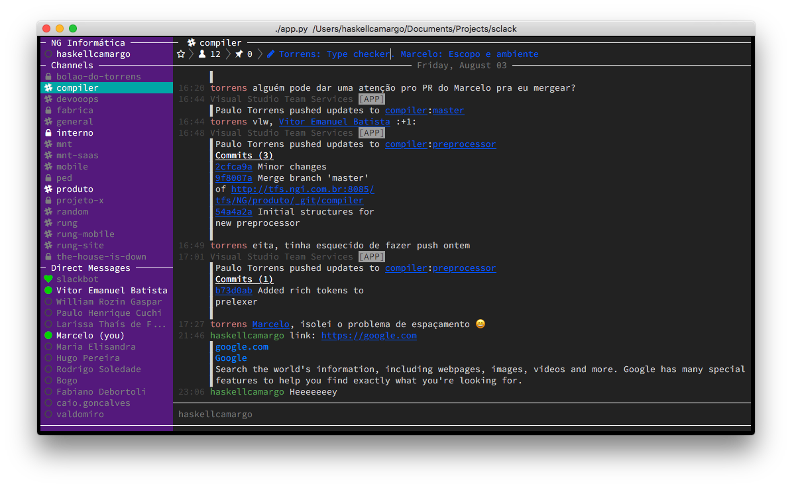
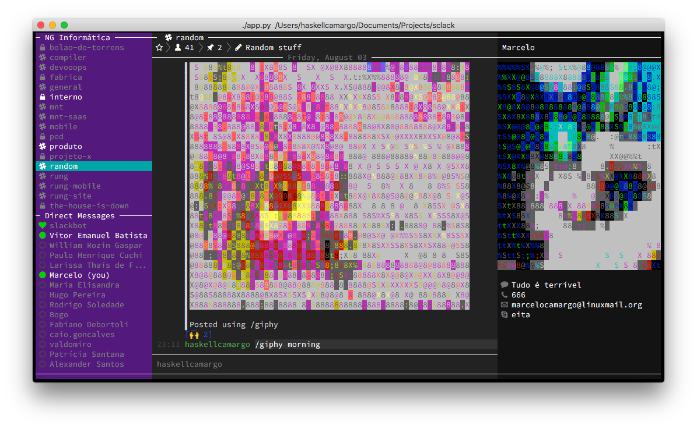
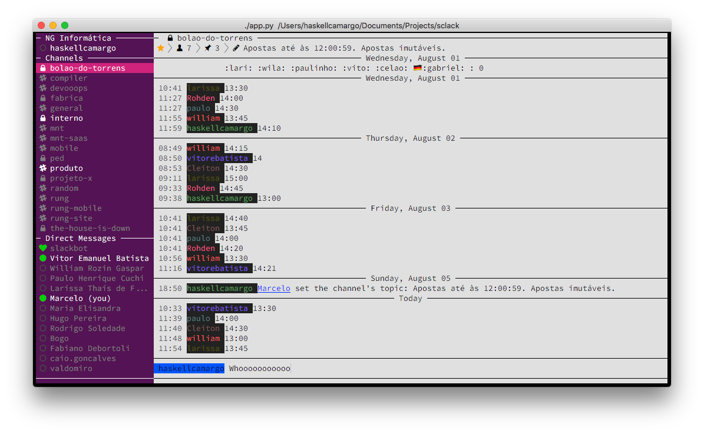
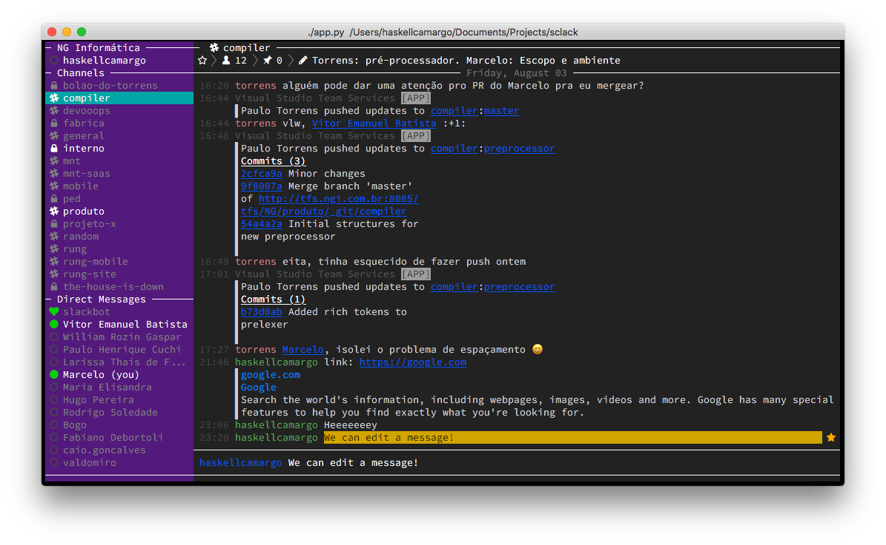

# Sclack

> The best CLI client for Slack, because everything is terrible!



## Disclaimer

The project is still under alpha, there are lots of things already done, but there is also a lot of work to do! If you want to help, please contact me under marcelocamargo@linuxmail.org or create an issue! Working in community, we can soon have a CLI client as complete as the web one!

## Setup

### Using legacy token

First of all get a [Slack token here](https://api.slack.com/custom-integrations/legacy-tokens).
Use, create or request a token for each workspace that you'll use on Sclack.
Not all workspaces allow you to generate a legacy token, so sometimes you'll need to
ask for the administrator to enable the feature.

### Without a legacy token

Unfortunately some serious hoops need to be jumped through to use a non-legacy token.

1. Go to <https://api.slack.com/apps>
2. Click "Create new app"
3. Give the app a name (maybe "Sclack") and select the server you'd like to use
4. Go to "Permissions" and add a new redirect URL: `http://localhost:8080`
5. Go back to the previous page, you'll be able to see "Client ID" (you will also need the "Client Secret" later). Use this to fill in this url:
```
    https://slack.com/oauth/authorize?client_id=[Client ID here]&scope=client
```    
6. Go to that URL in your browser, and authorize the app
7. The page will redirect to a blank page. Look at the URL and copy the `code=` parameter (http://localhost:8080?code=[code-will-be-here]&state=)
8. Now using the copied code, as well as the "Client ID" and "Client Secret" from the app page, fill in and execute this command:
```
    curl -s "https://slack.com/api/oauth.access?client_id=[client id here]&client_secret=[client secret here]&code=[code here]"
```
9. Finally, copy the `access_token` from the response (should start with `xoxs-`). This is your new auth token for Sclack

## Optional Dependencies

### Nerd Fonts

Sclack seems better when used with a [Nerd Font](https://nerdfonts.com/). Using
them is completely optional, but it is how some Sclack icons are possible.
Personally, I use [Fira Code Nerd Font](https://github.com/ryanoasis/nerd-fonts/releases/download/v2.0.0/FiraCode.zip).
Download, install and set as the default font of your terminal emulator.

### libcaca

Sclack uses `caca-utils` to create ANSI/VT100 + ASCII versions of pictures and
render them. Images will only be rendered if both `caca-utils` is installed
and `features.pictures` is configured to `true`. To install `caca-utils`, just
run `sudo apt-get install caca-utils` on Debian and `brew install libcaca --with-imlib2` on
OS X.

## Installation

### From Source

Ensure you have Python 3.4 or superior version.

pip
```bash
git clone https://github.com/haskellcamargo/sclack.git
cd sclack
pip3 install -r requirements.txt
chmod +x ./app.py
./app.py
```
pipenv
```bash
git clone https://github.com/haskellcamargo/sclack.git
cd sclack
export PIPENV_VENV_IN_PROJECT=1
pipenv install # install deps
pipenv shell # enter virtualenv
python app.py # run app
```

### From Binary

If you don't have Python installed, you can get the compiled binary for Sclack
on [releases](https://github.com/haskellcamargo/sclack/releases) page. Versions **will be** available for Linux x86/x64 and OS X.

## Running
Run `./app.py` after giving the correct permissions. If you don't have a `~/.sclack` file, you can generate one here by providing your workspace token. You can change the theme, enable or disable images, emojis, markdown, configure keyboards and everything else on `config.json`. Important: use `q` to quit!

Your `~/.sclack` file will look like:

```json
{
    "workspaces": {
        "default": "wow-such-secret"
    }
}
```

### Multiple workspaces

If you want to, you can use Sclack in multiple workspaces. You can have
at most 9 workspaces defined inside `workspaces`:

```json
{
    "workspaces": {
        "default": "wow-such-secret",
        "another": "wow-another-secret"
    }
}
```

You can use the keys from 1 up to 9 to switch workspaces or event right-click the indicator:




### Quick Switcher

You can use <kbd>ctrl k</kbd> (or your custom shortcut) to navigate in your DMs and channels.



### Set snooze

You can use <kbd>ctrl d</kbd> (or your custom shortcut) to set snooze time.

### Get permalink

Focus on message and press <kbd>r</kbd> (or your custom shortcut) to get permalink (Quote message) and it will be put into your chat box.

### Default keybindings
```json
{
  "keymap": {
    "cursor_down": "j",
    "cursor_left": "h",
    "cursor_right": "l",
    "cursor_up": "k",
    "delete_message": "d",
    "edit_message": "e",
    "go_to_chatbox": "c",
    "go_to_profile": "p",
    "go_to_sidebar": "esc",
    "open_quick_switcher": "ctrl k",
    "quit_application": "q",
    "set_edit_topic_mode": "ctrl t",
    "set_insert_mode": "i",
    "yank_message": "y",
    "get_permalink": "r",
    "set_snooze": "ctrl d",
    "toggle_thread": "t"
  }
}
```

The mouse support also has been programmed. You can scroll the chatbox and the sidebar and double click the channels to select.

### Sidebar

```json
{
    "sidebar": {
        "width": 25,
        "max_users": 20
    }
}
```

* `max_users`: Max users who are shown in the sidebar

### Features

```json
{
    "features": {
        "emoji": true,
        "markdown": true,
        "pictures": true,
        "browser": ""
    }
}
```
* `browser`: Config your preferable browser to open the link, when ever you focus on chat box text which contains external link (http/https), press enter key, the link will be opened. Valid [value](https://docs.python.org/2/library/webbrowser.html#webbrowser.get). Example you can config `"browser": "chrome"`

## Tested Terminals

Sclack has been tested with the following terminal emulators:

- Gnome Terminal
- iTerm2
- QTerminal
- Terminal (OS X)
- Terminator
- XTerm

## Testing

To run the tests first install the development dependencies via:
```
pip3 install -r requirements-dev.txt
```

and then run `pytest`.

## Contributing

Contributions are very welcome, and there is a lot of work to do! You can...
- Check out our [open issues](https://github.com/haskellcamargo/sclack/issues)
- Provide bug reports
- Create packages for pip, apt, dnf, rpm, pacman and brew
- Improve documentation
- Implement handler for new events
- Refactor the workarounds in the code
- Create new themes
- Make things easier to configure

## Screenshots








<p align="center">Made with :rage: by <a href="https://github.com/haskellcamargo">@haskellcamargo</a></p>
